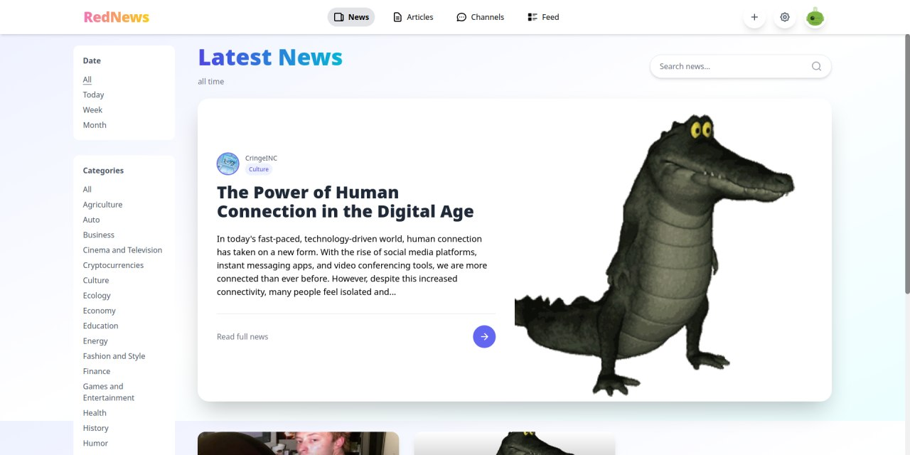

# News Portal - <span style="color:#FF0000">Red</span>News 📰

**RedNews** is a modern online portal designed for publishing and managing news and articles. This tool allows you to create and publish articles, share the latest news, and stay updated with new publications. By using the News Portal's functionality, you gain the following features:

- **Publish articles and news**: You can add new content by specifying the title, content, category, and tags, making the content creation process convenient and fast 📝
- **Create channels**: To organize content efficiently, you can create thematic channels that help structure information and simplify management 📂
- **Filter and sort**: With built-in filters by categories, tags, and publication dates, you can easily find the desired material in just a few seconds 🔍
- **Interact with content**: The portal provides like functionality, allowing users to express their opinions and engage with published content ❤️



## Technologies 💻

- **Language**: Elixir 🧪
- **Database**: PostgreSQL 🗄️
- **Libraries**:
  - Ecto {3.10} 📚
  - Phoenix {1.7} 📚
  - Tailwind {0.2} 📚
  - ExDoc {0.36} 📚
- **ORM**: Ecto 🛠️
- **Templating Engine**: HEEx 📝

## Installation and Launch 🚀

### 1. Install Dependencies

Ensure you have the following installed:

- Elixir (version 1.18.1) 🧪
- PostgreSQL (version 15) 🗄️
- Node.js (version 16 or higher) 📦

### 2. Clone the Repository

```bash
git clone https://github.com/adamanq/rednews.git
cd rednews
```

### 3. Install Project Dependencies

```bash
mix deps.get
```

### 4. Set Up the Database

Create the database and configure the connection in the `config/dev.exs` file:

```elixir
config :rednews, Rednews.Repo,
  username: "your_db_user",
  password: "your_db_password",
  database: "rednews_dev",
  hostname: "localhost",
  port: 5432,
  pool_size: 10
```

Create and run migrations:

```bash
mix ecto.create
mix ecto.migrate
```

### 5. Run the Application

```bash
mix phx.server
```

The application will be available at: [http://localhost:4000](http://localhost:4000). 🌐

## If You Want to Run in a Container 📦

> ❗️❗️ Currently, the stability of the application in a container leaves much to be desired, so it is recommended to use the standard build method ❗️❗️

### 6. Build the Portal Image

```bash
docker build .
```

### 7. Run the Container Group for the Application and Database

```bash
docker-compose up --build
```

### 8. Install Project Dependencies

```bash
docker-compose exec app mix deps.get
```

### 9. Set Up the Database

Create the database and configure the connection in the `config/dev.exs` file:

```elixir
config :rednews, Rednews.Repo,
  username: "your_db_user",
  password: "your_db_password",
  database: "rednews_dev",
  hostname: "db",
  port: 5432,
  pool_size: 10
```

Create and run migrations:

```bash
docker-compose exec app mix ecto.create
docker-compose exec app mix ecto.migrate
```

The application will be available at: [http://localhost:4000](http://localhost:4000). 🌐

## Usage 📖

1. **Registration and Login**: Create an account or log in
2. **Publishing Content**: Add an article or news by selecting a category and tags
3. **Filtering and Search**: Use filters to find the desired materials
4. **Likes and Comments**: Engage with content by expressing your opinion

## Project Structure 🗂️

- **lib/rednews** — Main application code
  - **accounts.ex** — Context for working with users and channels 👤
  - **posts.ex** — Context for working with articles, news, likes, and comments 📝
- **priv/repo/migrations** — Database migrations 🗄️
- **assets/** — Frontend resources (CSS, JavaScript) 🎨
- **config/** — Configuration files ⚙️

## License 📜

This project is distributed under the MIT License. For more details, see the [LICENSE](LICENSE) file.

## Author 👤

- [Adamanr](https://github.com/adamanr) 🧑‍💻

## How to Contribute 🤝

If you want to improve the project, follow these steps:

1. Fork the repository. 🍴
2. Create a branch for your feature (`git checkout -b feature/AmazingFeature`) 🌿
3. Commit your changes (`git commit -m 'Add some AmazingFeature'`) 💾
4. Push to your fork (`git push origin feature/AmazingFeature`) 🚀
5. Create a Pull Request 📥

If you have any questions or suggestions, create an [Issue](https://github.com/adamanr/rednews/issues) or contact me! 📩
